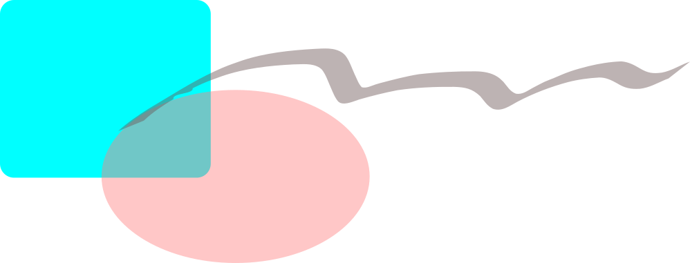

\newpage

\tableofcontents

\newpage

\listoffigures

\newpage

# Einleitung
Hier kommt einiger Text zum Thema der Arbeit und viele, viele Zitate [@Graeff1996]. Mal sehen, was passiert, wenn ich hier noch ein wenig Text einfüge. So, wenn ich weiter schreibe, und wieder speicher sollte es mir gelingen.

\newpage

# Fragestellung

\newpage

# Methoden

\newpage

# Diskussion

\newpage

# Literatur
